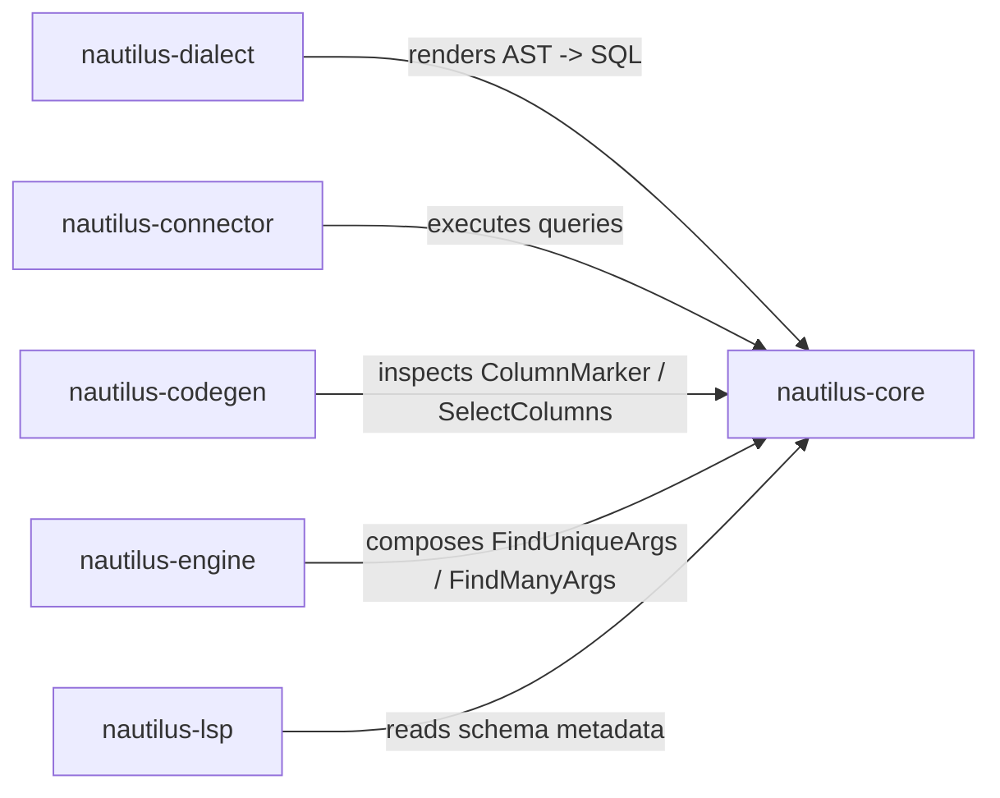

# nautilus-core

The foundational query AST and type system for the Nautilus ORM. Every other crate in the workspace depends on this one — it defines the language that queries, dialects, connectors, and the code generator all speak.

---

## Purpose

`nautilus-core` provides:

- A **query AST** — immutable value types representing SELECT, INSERT, UPDATE, and DELETE statements along with the expressions that can appear inside them.
- A **type system** — the `Value` enum that bridges Rust scalar types and database column values, along with the `FromValue` / `SelectColumns` traits that drive row decoding.
- A **column API** — typed `Column<T>` / `ColumnMarker` structs that carry table and column metadata and can build filter expressions in a type-safe way.
- **Query builders** — ergonomic `*Builder` facades (`SelectBuilder`, `InsertBuilder`, etc.) that produce validated AST nodes.
- A **cursor helper** — `build_cursor_predicate` for stable keyset pagination over composite primary keys.
- **Structured query arguments** — `FindUniqueArgs` and `FindManyArgs`, the entry points used by the engine and codegen layers.
- **Core error types** — `Error` and `Result` for query-construction failures (missing table, type mismatch, etc.); runtime execution errors live in `nautilus-connector`.

---

## Public API Overview

| Item | Description |
|------|-------------|
| `Value` | Unified column value enum (`Null`, `Bool`, `I32`, `I64`, `F64`, `Text`, `Bytes`, `Uuid`, `DateTime`, `Decimal`, `Json`, `Array`, `Array2D`) |
| `Expr` | Expression AST: comparisons, boolean logic, `IN`, `IS NULL`, `EXISTS`, `json_build_object`, raw `Literal` |
| `Column<T>` | Typed column reference; carries table name, column name, and a `PhantomData<T>` for builder methods like `.eq()`, `.gt()`, `.contains()` |
| `ColumnMarker` | Lightweight marker used by the codegen layer for reflection without a type parameter |
| `FromValue` | Trait implemented for every Rust type that can be decoded from a `Value` |
| `SelectColumns` | Trait for tuple-based multi-column decoding (1–8 elements); drives `SELECT` projection in connectors |
| `RowAccess` | Trait for looking up a column by alias in an abstract row |
| `Select` / `SelectBuilder` | SELECT AST + builder (columns, joins, filters, order, take/skip) |
| `Insert` / `InsertBuilder` | INSERT AST + builder (single and batch) |
| `Update` / `UpdateBuilder` | UPDATE AST + builder |
| `Delete` / `DeleteBuilder` | DELETE AST + builder |
| `FindUniqueArgs` | Query argument for a single-row lookup by a required `Expr` filter |
| `FindManyArgs` | Query argument for a multi-row query with optional filter, order, take, skip, and cursor |
| `build_cursor_predicate` | Builds a keyset-pagination `Expr` from a composite PK cursor token |
| `Error` / `Result` | Query-construction error enum and `std::result::Result<T, Error>` alias |

---

## Usage Within the Project

The dependency is strictly one-way: `nautilus-core` has **no knowledge** of SQL dialects, database drivers, or network transports.

---

## Design Notes

### Query builders are fallible at build time, not at execution time

All `*Builder::build()` methods validate the query (required fields present, column/value counts match, etc.) and return `Result<Ast>` eagerly. This means invalid queries are caught before they reach the connector or the dialect renderer.

### `Value` serde is explicit; plain JSON conversion is intentionally lossy

`Value` now serializes through an explicit tagged representation, so variants such as `Decimal`, `DateTime`, `Uuid`, `Bytes`, `Enum`, and `Array2D` round-trip without collapsing into plain strings or nested arrays. This serde form works with any format that can represent tagged enums.

When a caller specifically needs the historic untagged JSON shape used on transport and raw-query paths, use `Value::to_json_plain()` together with `json_to_value_ref`. That plain JSON conversion is intentionally lossy for string-backed typed values (`Decimal`, `DateTime`, `Uuid`, `Bytes`, `Enum`) because JSON itself carries no schema.

### `Array2D` is a connector-level concern

`json_to_value_ref` (the canonical JSON->Value converter) does **not** auto-promote `Array(Array(_))` to `Array2D`. Promotion happens in the connector stream decoders where the column schema is known, preventing silent misclassification of heterogeneous or empty nested arrays.

### `SelectColumns` arity is bounded at 8

Tuple `SelectColumns` impls are generated for arities 1–8. This is a deliberate limit; projections with more columns should use a named struct with a hand-written `FromRow` impl (generated by `nautilus-codegen`).
