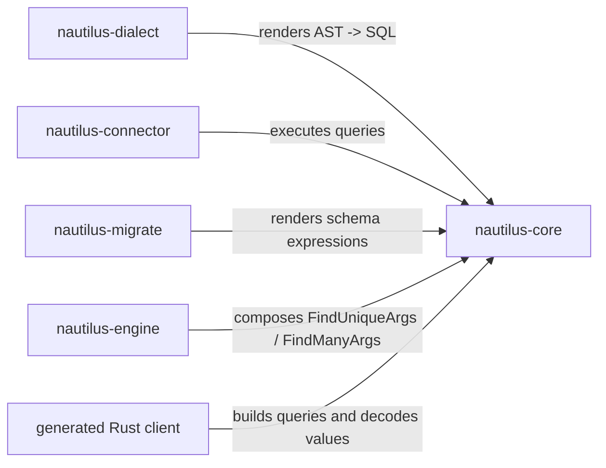

# nautilus-core

The foundational query AST and type system for the Nautilus ORM. It defines the values and query structures shared by dialects, connectors, the engine, and generated Rust clients.

---

## Purpose

`nautilus-core` provides:

- A **query AST** — immutable value types representing SELECT, INSERT, UPDATE, and DELETE statements along with the expressions that can appear inside them.
- A **type system** — the `Value` enum that bridges Rust scalar types and database column values, along with the `FromValue` / `SelectColumns` traits that drive row decoding.
- A **column API** — typed `Column<T>` / `ColumnMarker` structs that carry table and column metadata and can build filter expressions in a type-safe way.
- **Query builders** — ergonomic `*Builder` facades (`SelectBuilder`, `InsertBuilder`, etc.) that produce validated AST nodes.
- A **cursor helper** — `build_cursor_predicate` for stable keyset pagination over composite primary keys.
- **Structured query arguments** — `FindUniqueArgs` and `FindManyArgs`, the entry points used by the engine and codegen layers.
- **Core error types** — `Error` and `Result` for query-construction failures (missing table, type mismatch, etc.); runtime execution errors live in `nautilus-connector`.

---

## Public API Overview

| Item | Description |
|------|-------------|
| `Value` | Column values: null, numeric scalars, strings, bytes, UUIDs, datetimes, JSON, arrays, enums, composites, and PostgreSQL extension values |
| `PlainValueRef` | Serializes a borrowed `Value` as plain wire JSON without building an intermediate JSON tree |
| `Expr` | Expression AST: comparisons, boolean logic, `IN`, `IS NULL`, `EXISTS`, `json_build_object`, raw `Literal` |
| `Column<T>` | Typed column reference; carries table name, column name, and a `PhantomData<T>` for builder methods like `.eq()`, `.gt()`, `.contains()` |
| `ColumnMarker` | Lightweight marker used by the codegen layer for reflection without a type parameter |
| `FromValue` | Trait implemented for every Rust type that can be decoded from a `Value` |
| `SelectColumns` | Trait for tuple-based multi-column decoding (1–8 elements); drives `SELECT` projection in connectors |
| `RowAccess` | Trait for looking up a column by alias in an abstract row |
| `Select` / `SelectBuilder` | SELECT AST + builder (columns, joins, filters, order, take/skip) |
| `Insert` / `InsertBuilder` | INSERT AST + builder (single and batch) |
| `Update` / `UpdateBuilder` | UPDATE AST + builder |
| `Delete` / `DeleteBuilder` | DELETE AST + builder |
| `FindUniqueArgs` | Query argument for a single-row lookup by a required `Expr` filter |
| `FindManyArgs` | Query argument for a multi-row query with optional filter, order, take, skip, and cursor |
| `build_cursor_predicate` | Builds a keyset-pagination `Expr` from a composite PK cursor token |
| `Error` / `Result` | Query-construction error enum and `std::result::Result<T, Error>` alias |

---

## Usage Within the Project

```mermaid
graph LR
  core[nautilus-core]
  dialect[nautilus-dialect]
  connector[nautilus-connector]
  migrate[nautilus-migrate]
  engine[nautilus-engine]
  client[generated Rust client]

  dialect -->|renders AST -> SQL| core
  connector -->|executes queries| core
  migrate -->|renders schema expressions| core
  engine -->|composes FindUniqueArgs / FindManyArgs| core
  client -->|builds queries and decodes values| core
```

The dependency is strictly one-way: `nautilus-core` has **no knowledge** of SQL dialects, database drivers, or network transports.

---

## Design Notes

### Where value behavior lives

| Module | Responsibility |
|--------|----------------|
| `value/mod.rs`, `value/wrappers.rs` | Internal `Value` variants and textual `Geometry` / `Geography` wrappers; existing public paths are re-exported by the facade |
| `value/conversions.rs` | Rust-to-`Value` conversions, including optional values and arrays |
| `value/tagged.rs` | Tagged serde encoding by reference and decoding through an owned representation |
| `value/plain.rs` | Plain JSON trees, borrowed `PlainValueRef` serialization, and internal JSON-to-`Value` inference |
| `value/scalar_text.rs` | Shared datetime parsing/formatting and borrowed string encodings for decimal, UUID, and bytes |
| `column/from_value/mod.rs` | Public `FromValue` and `ExtensionScalar` contracts |
| `column/from_value/{scalars,collections,extensions}.rs` | Column decoding, including owned conversions and JSON storage alternatives |

To add a value variant, define it in `value/mod.rs`, its Rust conversions in `conversions.rs`, and both wire representations in `tagged.rs` and `plain.rs`. Add column decoding in the corresponding `from_value` module. Extend the shared serialization samples in `value/test_values.rs` and the tagged round-trip cases; tests for each codec and decoder live beside their implementation. Public conversion examples remain in `tests/value_conversions.rs`. The `value_serde` benchmark covers tagged encoding/decoding and plain JSON trees; the engine's `rows_json` benchmark exercises borrowed row serialization.

### Where the engine payload is written

| Module | Responsibility |
|--------|----------------|
| `protocol_json/mod.rs` | Facade re-exporting the three public conversions |
| `protocol_json/args.rs` | `FindManyArgs` and its `include` entries written as the request object |
| `protocol_json/filters.rs` | A filter `Expr` written as the `where` object, including relation predicates and `AND` / `OR` flattening |
| `protocol_json/expressions.rs` | Column references and value operands, including the LIKE pattern that carries a substring operator |

To add an argument, write it in `args.rs` and count it in the capacity helper; to add a filter operator, map it in `filters.rs` and add its operand handling to `expressions.rs`. The engine has to accept what is produced: `nautilus-engine`'s `filter` module parses the payload back, and its round-trip test is the contract between the two.

### Query builders are fallible at build time, not at execution time

All `*Builder::build()` methods validate the query (required fields present, column/value counts match, etc.) and return `Result<Ast>` eagerly. This means invalid queries are caught before they reach the connector or the dialect renderer.

### `Value` serde is explicit; plain JSON conversion is intentionally lossy

`Value` now serializes through an explicit tagged representation, so variants such as `Decimal`, `DateTime`, `Uuid`, `Bytes`, `Enum`, and `Array2D` round-trip without collapsing into plain strings or nested arrays. This serde form works with any format that can represent tagged enums.

Transport and raw-query paths use `Value::to_json_plain()` when they need an owned JSON tree, or `PlainValueRef(&value)` to serialize directly by reference. String-backed types such as `Decimal`, `DateTime`, `Uuid`, `Bytes`, and `Enum` lose their type identity in this representation because JSON carries no schema. `json_to_value_ref` is the crate-internal reverse conversion; schema-aware reconstruction belongs to the engine and connectors.

### `Array2D` is a connector-level concern

`json_to_value_ref` (the canonical JSON->Value converter) does **not** auto-promote `Array(Array(_))` to `Array2D`. Promotion happens in the connector stream decoders where the column schema is known, preventing silent misclassification of heterogeneous or empty nested arrays.

### `SelectColumns` arity is bounded at 8

Tuple `SelectColumns` impls are generated for arities 1–8. This is a deliberate limit; projections with more columns should use a named struct with a hand-written `FromRow` impl (generated by `nautilus-codegen`).
